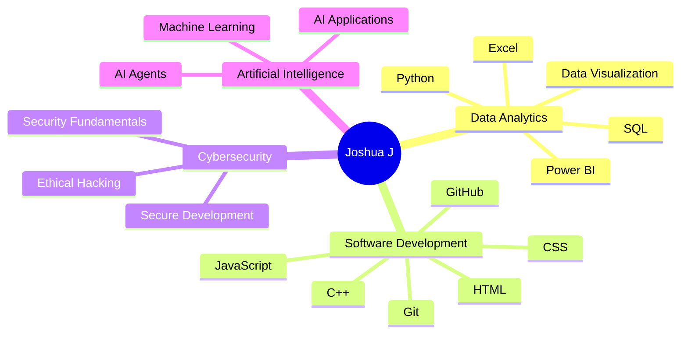
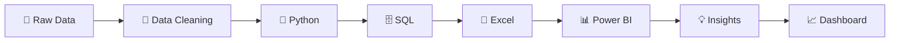

<div align="center">


<br>


<br><br>

<a href="https://github.com/offxjosh07-jpg">

</a>

<a href="https://www.linkedin.com/">

</a>

</div>

---

# 👨‍💻 About Me

I'm **Joshua J**, a **B.Tech Information Technology student** focused on learning, building and solving real-world problems with technology.

- 🎓 B.Tech Information Technology
- 📊 Data Analytics & Business Intelligence
- 🔐 Cybersecurity & Secure Development
- 🤖 Artificial Intelligence & Machine Learning
- 💻 Python • SQL • C++ • Excel • Power BI
- 🚀 Building practical projects
- 📚 Learning by building and experimenting

---

# 🧠 Skills Tree



---

# 🚀 Featured Projects

## 🤖 JAWS — AI Voice & Coding Assistant

An AI-powered agent designed to understand a task, plan actions, select tools, execute them, verify results and continue until completion.

### ✨ Features

- 🎙️ Voice interaction
- 💬 AI chat
- 🧠 Task planning
- 🛠️ Tool selection
- 💻 Terminal execution
- 📁 File operations
- 🔎 Result checking
- 🐙 Git / GitHub workflow
- 🔄 Agent loop

### 🧰 Technologies

`React` `Vite` `JavaScript` `AI APIs` `GitHub` `Terminal`

### 🔄 Agent Workflow

```text
Understand
    ↓
Plan
    ↓
Select Tool
    ↓
Execute
    ↓
Check Result
    ↓
Continue
    ↓
Report
```

---

## 🌲 ForestGuard — Forest Monitoring Dashboard

A modern dashboard concept focused on forest monitoring, alerts, location intelligence and analytics.

### ✨ Features

- 🗺️ Interactive map
- 🌲 Forest monitoring
- 🚨 Alert system
- 📍 Location intelligence
- 📊 Data visualization
- 📈 Analytics dashboard
- 🌙 Dark interface
- 📱 Responsive UI

### 🧰 Technologies

`HTML` `CSS` `JavaScript` `Maps API` `Charts` `Dashboard UI`

---

## 📈 Data Analytics Pipeline

A practical workflow for transforming raw data into useful insights and dashboards.



---

# 🛠️ Tech Stack

<div align="center">


<br><br>


</div>

---

# 🎯 Currently Learning

| Domain | Focus |
|---|---|
| 🐍 Python | Programming & Data Analysis |
| 🗄️ SQL | Queries & Databases |
| 📊 Power BI | Dashboards & Visualization |
| 📗 Excel | Data Analysis |
| ⚡ C++ | OOP & Problem Solving |
| 🔐 Cybersecurity | Security Fundamentals |
| 🤖 AI / ML | Intelligent Applications |
| 🌐 Web Development | Modern Web Applications |

---

# 📊 GitHub Statistics

<div align="center">


</div>

---

# 🔥 GitHub Streak

<div align="center">


</div>

---

# 🧊 3D Contribution Profile

<div align="center">


</div>

---

# 🧰 Tools I Use

<div align="center">


</div>

---

# 📈 Contribution Activity

<div align="center">


</div>

---

# 🌐 Connect With Me

<div align="center">

<a href="https://github.com/offxjosh07-jpg">

</a>

<a href="https://www.linkedin.com/">

</a>

</div>

---

# 👀 Profile Visitors

<div align="center">


</div>

---

<div align="center">

## 💭 BUILD • LEARN • IMPROVE • REPEAT

⭐ **Thanks for visiting my profile!**

</div>
